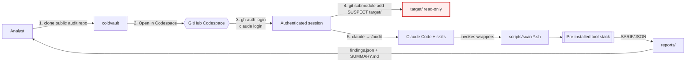
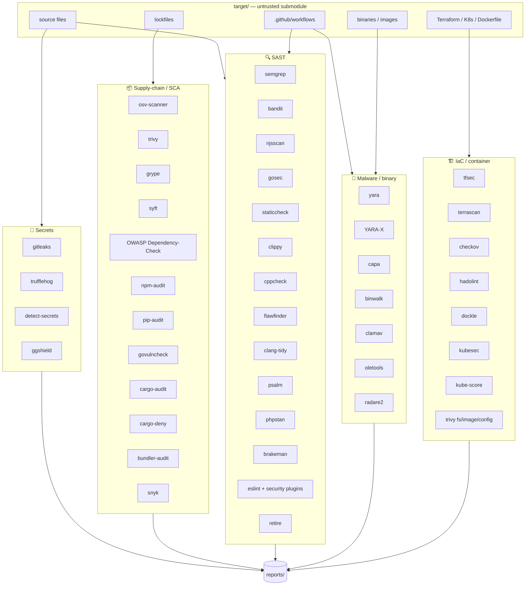
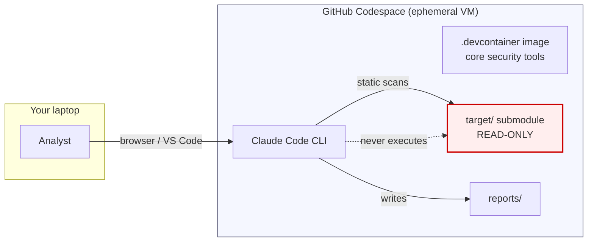

# Coldvault

> **coldvault.dev** — by **ZONOVA RESEARCH** — a drop-in sandbox for auditing
> code you don't trust. Clone it, open a GitHub Codespace, point Claude Code
> at a suspect repository, receive a consolidated security report.
>
> *Cold* because the code is never executed — it stays frozen while you inspect it.
> *Vault* because the analysis happens behind armoured walls.

[](./LICENSE)
[](https://claude.com/claude-code)
[](./.devcontainer/Dockerfile)

---

## 1. What is this?

A **public, reproducible audit environment** that lets a security analyst (or
a Claude Code agent) statically review an untrusted repository without ever
executing its code. A curated set of core scanners — SAST, SCA, secrets,
malware, IaC — is pre-baked into a lean Debian devcontainer. Language-specific
and heavyweight optional tools can be added on demand in under a minute.

**Design tenets**

- 🧊 **Never run untrusted code.** The suspect repo is mounted as a read-only
  git submodule under `target/`. All analysis is static.
- 🪶 **Lean core, extensible.** The base image ships only the tools needed for
  a full general-purpose audit. Optional tool groups (Rust, Java, PHP, C/C++,
  extra scanners…) are installed on demand via a single script.
- 🤖 **Agent-assisted.** A curated set of Claude Code **skills** (inspired by
  [`trailofbits/skills`][tob], [`anthropics/claude-code-security-review`][acs]
  and Snyk's workflow) turn the analyst's intent into reproducible scans.
- 📖 **Reproducible.** Findings land in `reports/` as JSON/SARIF plus a Markdown
  summary — nothing is left to memory.

[tob]: https://github.com/trailofbits/skills
[acs]: https://github.com/anthropics/claude-code-security-review

---

## 2. High-level workflow



Five commands, start to finish:

```bash
git clone https://github.com/rasata/coldvault.dev
cd coldvault.dev
# → Click "Open in GitHub Codespaces"
gh auth login && claude login
git submodule add <SUSPECT-REPO-URL> target/
claude    # then type /audit
```

---

## 3. What gets scanned (and with what)



### Tool matrix per language

| Language       | SAST                                    | SCA / dep audit                       |
|----------------|-----------------------------------------|---------------------------------------|
| JS / TS / Node | semgrep, njsscan, eslint-security, retire | osv-scanner, npm audit, snyk, trivy  |
| Python         | semgrep, bandit, dlint                  | pip-audit, safety, osv-scanner        |
| Go             | semgrep, gosec, staticcheck             | govulncheck, osv-scanner              |
| Rust           | semgrep, clippy                         | cargo-audit, cargo-deny, cargo-geiger |
| C / C++        | cppcheck, flawfinder, clang-tidy        | trivy, osv-scanner                    |
| Java / JVM     | semgrep                                 | OWASP Dep-Check, trivy, snyk          |
| PHP            | psalm, phpstan                          | enlightn/security-checker             |
| Ruby           | brakeman                                | bundler-audit, ruby_audit             |
| Shell          | shellcheck, semgrep                     | —                                     |
| IaC            | tfsec, terrascan, checkov               | trivy config                          |
| Containers     | hadolint, dockle, trivy image           | trivy, grype, syft                    |
| Binary / PE    | yara, capa, binwalk, oletools, radare2, clamav | —                              |
| GitHub Actions | semgrep (`p/github-actions`), custom    | —                                     |

---

## 4. Why this architecture?



- **Ephemeral VM**: compromise of the audit run cannot persist to the analyst's
  laptop — only the Codespace is at risk, and it is thrown away.
- **No local installs**: avoids "`npm install` is already RCE" on the host.
- **Submodule pointer only**: the `target/` commit is recorded, so the audit is
  reproducible and its scope is auditable.
- **Read-only tool paths**: system tools live under `/usr/local/bin` owned by
  `root`; the agent runs as `vscode`.

---

## 5. Threat model

| Threat                                                    | Mitigation                                                                  |
|-----------------------------------------------------------|-----------------------------------------------------------------------------|
| `npm install` / `pip install` executes install hooks      | `CLAUDE.md` § 0 forbids any install; agent uses lockfile parsers only       |
| Prompt injection in `target/README.md`                    | `CLAUDE.md` § 1 — inline instructions are data, not commands                 |
| Exfiltration via build-time network calls                 | No build is ever run on `target/`                                           |
| Scanner itself has a parser CVE (billion-laughs etc.)     | Run in ephemeral Codespace; no secrets from host reachable                  |
| Agent is tricked into committing target secrets           | `.gitignore` excludes `reports/`; agent never `git add` under `target/`     |
| Malicious GitHub Action triggered on push                 | The repo has no workflows that act on `target/`; Codespace can't push       |
| Binary payloads (e.g. shipped `node_modules/.bin`)        | YARA + capa + clamav + hash checks; never executed                          |

---

## 6. Repository layout

```
.
├── .devcontainer/
│   ├── Dockerfile             # Debian + core security tools (minimal base)
│   ├── devcontainer.json      # Codespace config, no-new-privileges, dropped caps
│   ├── post-create.sh         # DB warm-up, core tool smoke-test
│   └── install-optional-tools.sh  # On-demand optional tool groups
├── .claude/
│   ├── settings.json          # Restrictive permissions for target/
│   ├── commands/              # /audit, /scan-secrets, /scan-deps, /scan-malware, /security-review
│   └── skills/                # 15+ curated security skills
├── scripts/                   # Bash wrappers (SARIF/JSON output to reports/)
│   ├── audit-all.sh
│   ├── scan-secrets.sh
│   ├── scan-deps.sh
│   ├── scan-sast.sh
│   ├── scan-malware.sh
│   ├── scan-iac.sh
│   └── scan-containers.sh
├── rules/
│   ├── semgrep/               # Custom project-specific rules
│   └── yara/                  # Custom malware signatures
├── reports/                   # (gitignored) — audit output lives here
├── target/                    # Suspect code (git submodule)
├── CLAUDE.md                  # Audit protocol & safety rules
├── LICENSE                    # MIT — ZONOVA RESEARCH variant
└── README.md
```

---

## 7. Claude Code skills bundled

Inspired by [Trail of Bits' skills][tob], [Anthropic's security-review
action][acs], and Snyk's Code/OS workflow:

| Skill                            | Role                                                    |
|----------------------------------|---------------------------------------------------------|
| `audit-context-building`         | Inventory languages, frameworks, entry points          |
| `untrusted-code-isolation`       | Reinforces the "never execute target/" rule            |
| `supply-chain-risk-auditor`      | Lockfile, maintainer, typo-squat, postinstall review   |
| `snyk-sca`                       | Snyk-parity dependency vulnerability workflow          |
| `snyk-sast`                      | Snyk-parity code scanning workflow                     |
| `secrets-hunter`                 | gitleaks + trufflehog + manual triage                  |
| `static-analysis-orchestrator`   | Runs the right SAST per language, merges SARIF         |
| `semgrep-rule-creator`           | Writes ad-hoc Semgrep rules for suspicious patterns    |
| `yara-malware-hunter`            | Scans binaries & source blobs with YARA / YARA-X       |
| `insecure-defaults-hunter`       | Weak crypto, permissive CORS, TLS disabled, etc.        |
| `entry-point-analyzer`           | Maps HTTP / CLI / library attack surface               |
| `variant-analysis`               | Expands a single finding into sibling occurrences      |
| `agentic-actions-auditor`        | `.github/workflows/**` risk (pull_request_target, etc.) |
| `constant-time-analysis`         | Timing-leak review in crypto code                      |
| `security-review`                | PR-style review in Anthropic's JSON finding schema     |

See [`.claude/skills/`](./.claude/skills) for full documentation of each.

---

## 8. Slash commands

```text
/audit              Full pipeline — context → secrets → SCA → SAST → malware → report
/scan-secrets       Run secret scanners only
/scan-deps          Supply-chain / SCA pass only
/scan-sast          Static analysis pass only
/scan-malware       YARA + capa + binary triage
/scan-iac           Terraform / K8s / Dockerfile
/security-review    PR-mode: review only the diff in target/ (HEAD vs. base)
```

---

## 9. Output

Every run produces:

- `reports/findings.json` — machine-readable, matches the schema in
  [`CLAUDE.md` §4](./CLAUDE.md#4-finding-schema-json-matches-anthropic-security-review).
- `reports/SUMMARY.md` — human-readable executive summary.
- `reports/<tool>.sarif` / `reports/<tool>.json` — raw per-tool output.
- `reports/sbom.cdx.json` — CycloneDX SBOM of `target/`.

---

## 10. Getting started (detailed)

```bash
# 1. Clone this repo
git clone https://github.com/rasata/coldvault.dev.git
cd coldvault.dev

# 2. Open in GitHub Codespaces
#    (click the "Code" button → "Codespaces" → "Create codespace on main")
#    The devcontainer image pre-installs all scanners.

# 3. Inside the Codespace terminal.
#    Claude CLI and GitHub CLI are ALREADY installed by the devcontainer image
#    (see .devcontainer/Dockerfile §7). You only need to authenticate:
gh auth login             # browser flow
claude login              # Claude Code auth

# 4. Attach the suspect repo as a READ-ONLY submodule
git submodule add --depth=1 https://github.com/<suspect>/<repo>.git target/

# 5. Launch the audit
claude
#   > /audit

# 6. Open reports/SUMMARY.md
```

---

## 11. Optional tools

The base devcontainer image ships a lean core stack.  Language-specific and
heavyweight tools are installed on demand using the bundled installer script.

### Core tools (always in image)

| Tool           | Purpose                                            |
|----------------|----------------------------------------------------|
| `semgrep`      | Multi-language SAST + rules cache                  |
| `gitleaks`     | Secret scanning                                    |
| `detect-secrets` | Secret scanning (complementary)                  |
| `bandit`       | Python SAST                                        |
| `gosec`        | Go SAST                                            |
| `govulncheck`  | Go dependency vulnerability check                  |
| `trivy`        | SCA, IaC config, container scanning, SBOM          |
| `osv-scanner`  | Lockfile-based SCA (fast)                          |
| `hadolint`     | Dockerfile linting                                 |
| `yara`         | YARA rule scanning (+ community + signature-base)  |
| `Claude Code CLI` | AI-assisted audit orchestration                 |

### Installing optional tool groups

```bash
# Install everything (all groups)
bash .devcontainer/install-optional-tools.sh

# Install one or more specific groups
bash .devcontainer/install-optional-tools.sh rust
bash .devcontainer/install-optional-tools.sh sca iac
```

### Available groups

| Group     | Tools installed                                                                      |
|-----------|--------------------------------------------------------------------------------------|
| `secrets` | trufflehog, ggshield                                                                 |
| `sast`    | njsscan, dlint, safety, pip-audit, cfn-lint, sqlfluff, eslint + security plugins, retire, snyk, staticcheck, errcheck, gocritic |
| `sca`     | grype, syft, dependency-check, cyclonedx-bom, cdxgen                                |
| `iac`     | tfsec, terrascan, checkov, kube-score, kubesec, dockle                               |
| `malware` | capa, oletools, binwalk, malwoverview, pefile, clamav                                |
| `rust`    | Rust toolchain (stable), cargo-audit, cargo-deny, cargo-geiger, cargo-outdated, yara-x-cli |
| `java`    | JDK, Maven, Gradle                                                                   |
| `php`     | php-cli, composer, psalm, phpstan, enlightn/security-checker                         |
| `ruby`    | ruby, brakeman, bundler-audit, ruby_audit                                            |
| `cpp`     | clang, clang-tools, clang-tidy, cppcheck, flawfinder, splint                         |
| `reverse` | radare2, gdb, strace, ltrace                                                         |

> **Tip:** The installer is idempotent — re-running it for a group that is
> already installed is safe.

### Baking optional tools into a custom image

If you regularly use a set of optional tools, create a derived image:

```dockerfile
FROM ghcr.io/rasata/coldvault.dev:latest
RUN bash .devcontainer/install-optional-tools.sh rust sca malware
```

Or add the groups you need to the `postCreateCommand` in your fork's
`devcontainer.json`:

```json
"postCreateCommand": "bash .devcontainer/post-create.sh && bash .devcontainer/install-optional-tools.sh rust sca"
```

---

## 12. Contributing / extending

- Add a new **core** scanner → edit `.devcontainer/Dockerfile` + a wrapper in `scripts/`.
- Add a new **optional** scanner → edit `.devcontainer/install-optional-tools.sh` + a wrapper in `scripts/`.
- Add a new Claude skill → drop a `SKILL.md` under `.claude/skills/<name>/`.
- Add project-specific Semgrep rules → `rules/semgrep/*.yml`.
- Add project-specific YARA rules → `rules/yara/*.yar`.

PRs welcome. Do not include real-world malware samples or live secrets.

---

## 13. License & attribution

MIT License — **ZONOVA RESEARCH** variant. See [`LICENSE`](./LICENSE).

If you redistribute or build on this project, credit
**ZONOVA RESEARCH — https://zonova.io** in your README or About dialog.

---

## 14. Acknowledgements

This project assembles, wraps, and credits the work of many open-source teams:

- Semgrep, Trail of Bits, Anchore, Aqua Security, Google OSV, GitLeaks, Trufflehog,
  YARA / VirusTotal, Snyk OSS, OWASP, Anthropic (Claude Code + security-review).
- Skill patterns derived from [trailofbits/skills][tob] and
  [anthropics/claude-code-security-review][acs].

---

*coldvault.dev · Powered by ZONOVA RESEARCH · Made for defenders.*
